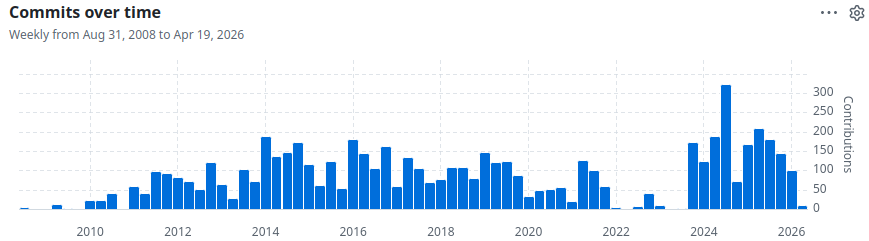

```{r Ropts, echo=FALSE}
knitr::opts_chunk$set(
  dpi=100,
  fig.width=12,
  fig.height=4)
```

Happy birthday, `data.table`!

# Introduction: GitHub commits and governance

Since this is the 20th anniversary of Matt’s original CRAN submission, I wanted to do some analysis of contributors over time, to emphasize the great community that has been working to improve `data.table` in recent years.

To do that, a simple way is to look at the [commit history](https://github.com/Rdatatable/data.table/issues/7698#issuecomment-4319601361) on GitHub:



Above we can see that there is a record number of commits since late 2023, which is when the formal project [governance](https://github.com/Rdatatable/data.table/blob/master/GOVERNANCE.md) was adopted.
That was a turning point in the package’s history.
Prior to that, Matt Dowle was reviewing and merge all PRs.
Matt did a fantastic job ensuring quality and performance, but it was difficult to handle the sheer volume of issues and PRs, since `data.table` is so widely used in the R community (1700+ other CRAN packages list `data.table` as a hard dependency as of April 2026).
Now, there is a group of several committers, including myself, that can review and merge PRs.
So it is much easier to handle the increased number of contributions from the much larger group of people that are now using `data.table`.
If you are using `data.table`, please consider contributing!
We are an open and diverse group, and [there are lots of ways to contribute](https://github.com/Rdatatable/data.table?tab=contributing-ov-file):

* writing a tutorial about `data.table` on your blog.
* look at the [list of open issues on GitHub](https://github.com/Rdatatable/data.table/issues), try to reproduce the issue on your machine, and add a comment to the issue that explains if the issue is still happening on your machine (or not).
* sending us a new issue,
  * if you think there may be a problem that could be fixed.
  * if you have an important use case for which we could possibly add new tests (for validity of output, or for [performance using atime](https://github.com/Rdatatable/data.table/wiki/Performance-testing)).
  * anything else! We primary use issues to communicate, so please do not hesitate to open a new issue.
* write a PR with a
  * vignette translation, currently available in [en](https://r-datatable.com/articles/datatable-intro.html), [es](https://rdatatable.gitlab.io/data.table/articles/es/datatable-intro.html), [fr](https://rdatatable.gitlab.io/data.table/articles/fr/datatable-intro.html), [ru](https://rdatatable.gitlab.io/data.table/articles/ru/datatable-intro.html).
  * fix for an existing issue.
  * When the PR is merged, you will be invited to become a [Project Member](https://github.com/Rdatatable/data.table/blob/master/GOVERNANCE.md#project-member), meaning you will have permission to create new branches in the central `data.table` repo.
* Volunteer to become [a Reviewer](https://github.com/Rdatatable/data.table/blob/master/GOVERNANCE.md#reviewer) for the R or C code files in `data.table` that are important to you! You will be notified when there is a PR with modifications, and you can comment to ask for improvements to the PR.
* Eventually after contributing and reviewing several PRs, you can be invited to become a Committer, with permission to merge PRs into the master branch.

Now is a great time to get involved.
Your contributions to `data.table` will be greatly appreciated by the community around `data.table`, including the wider community of other packages that depend on `data.table` for its state-of-the-art efficiency.

# New analysis of CRAN authors and contributors

In the rest of this article, my goal is to analyze the number of authors and contributors in CRAN releases of `data.table`.
We first download data on all releases, using code from [my previous post](https://tdhock.github.io/blog/2022/release-history/) about the release history of `data.table`.

## Download Archive web page

We can download the Archive web page for `data.table` via the code below.
Note that In R ≥ 4.5, `tools::CRAN_archive_db()` can be used, but here we use `download.file()` to give an example of how HTML can be parsed into a data table using `library(nc)`.

```{r}
Archive <- "https://cloud.r-project.org/src/contrib/Archive/"
get_Archive <- function(Package, releases.dir="~/releases"){
  dir.create(releases.dir, showWarnings = FALSE)
  pkg.html <- file.path(releases.dir, paste0(Package, ".html"))
  if(!file.exists(pkg.html)){
    u <- paste0(Archive, Package)
    download.file(u, pkg.html)
  }
  readLines(pkg.html)
}
(Archive.data.table <- get_Archive("data.table"))
```

The output above shows that the Archive web page has a regular structure, which we can convert into a data table using the regular expression pattern below.

```{r}
file.pattern <- list(
  '(?<=>)',
  package=".*?",
  "_",
  version="[0-9.-]+",
  "[.]tar[.]gz")
```

The code above specifies a regular expression:

* `'(?<=>)'` is a lookbehind assertion. It means to start by looking for a greater than sign, but not including that character in the match.
* `package=".*?"` means to match zero or more of anything except newline (non-greedy, as few as possible), and output the match in the `package` column,
* `"_"` means to start by matching an underscore,
* `version="[0-9.-]+"` means to match one or more digits/dots/dashes, and
  output them in the `version` column,
* `"[.]tar[.]gz</a>\\s+"` means to match the `.tar.gz` file name suffix.

Below we use that pattern to convert the web page into a data table with two columns,

```{r}
options(datatable.print.nrows=20) # instead of default 100.
nc::capture_all_str(Archive.data.table, file.pattern)
```

Next, we add to the pattern to match the release date,

```{r}
library(data.table)
Archive.pattern <- list(
  file=file.pattern,
  "</a>",
  "\\s+",
  IDate=".*?", as.IDate,
  "\\s")
```

The code above has

* `file=file.pattern` which means to apply the previous regex, and put the matching text in the `file` column,
* `"</a>"` which matches the closing `</a>` tag
* `"\\s+"` which matches one or more white space characters,
* `IDate=".*?", as.IDate,` which matches zero or more characters (non-greedy,
  as few as possible), then use `as.IDate` to convert the text to efficient integer date, saved in the `IDate` column,
* `"\\s"` means to match one white space character.

The end result is a table with one row for each matched package version, and one column for each of the named arguments:

```{r}
(Archive.dt <- nc::capture_all_str(Archive.data.table, Archive.pattern))
```

Above the table shows all matches, in the same order as the original Archive web page.
Below we key the table by date, which sorts the data in place (without allocating any new memory), and enables fast joins.

```{r}
setkey(Archive.dt, IDate)
Archive.dt
```

We see the table above has been sorted by release date.
Next, we define a grid of dates which we will search for the nearest release.

```{r}
every.year.since.2016 <- seq(
  as.IDate("2016-04-14"),
  Sys.time(),
  by="year")
(grid.dt <- setkey(data.table(
  grid.IDate=c(
    as.IDate("2006-04-14"), # first release.
    as.IDate("2011-04-14"), # fifth anniversary.
    every.year.since.2016))))
```

The code above sets the key of the grid, which sorts and enables fast joins.
No variables were specified to `setkey()`; the default is to use all columns, in this case just one.
Note that `setkey()` sets the key by reference, then returns the table.

Next, we do a rolling join to find which releases are nearest to each date in the grid.

```{r}
(nearest.dt <- unique(Archive.dt[grid.dt, .(
  file, version, package, release=x.IDate
), roll="nearest"]))
```

The output above shows one row per release we will analyze.
For each release, we download the package sources from the Archive, and extract the Author field of DESCRIPTION.

```{r}
desc.dt <- nearest.dt[, {
  cache.dir <- "~/Archive"
  dir.create(cache.dir, showWarnings = FALSE)
  dt.tar.gz <- file.path(cache.dir, file)
  if(!file.exists(dt.tar.gz)){
    url.tar.gz <- paste0(Archive, package, "/", file)
    download.file(url.tar.gz, dt.tar.gz)
  }
  conn <- gzfile(dt.tar.gz, "b")
  DESCRIPTION <- file.path(package, "DESCRIPTION")
  untar(conn, files=DESCRIPTION)
  close(conn)
  as.data.table(read.dcf(DESCRIPTION)[,"Author",drop=FALSE])
}, by=.(version, release)]
```

To avoid printing the full Author column (a long string), we can set an option:

```{r}
options(
  datatable.prettyprint.char=30, # print ... after this many characters.
  width=100) # max characters before wrapping columns to next line.
desc.dt
```

We see above that the `Author` field can contain newlines (after the comma), which we remove below, to make later parsing easier:

```{r}
desc.dt[, no.newlines := gsub("\n", " ", Author)][]
```

The output above has a new column of comma-separated authors per release (with no newlines).
We would like to convert these data to a table with one year per author.
A simple approach would be

```{r}
head(sapply(strsplit(desc.dt$no.newlines, ", "), head))
```

It is clear that the result above does not quite work (Matt’s `aut, cre` role contains a comma so is broken into two entries).
Instead we can use the regular expression below.

```{r}
author.pattern <- list(
  name=".+?",
  nc::quantifier(
    " \\[",
    roles=".+?",
    "\\]",
    "?"),
  nc::quantifier(
    " \\(", 
    paren=".+?",
    "\\)",
    "?"),
  ## each author ends with one of these (\z means end of string).
  nc::alternatives(" with (?:many )?contributions from ", ", ", "\\z"))
(author.dt <- desc.dt[, nc::capture_all_str(
  no.newlines, author.pattern
), by=.(version, release)])
```

The table above has one row for each time a person appears in the Author field of one of the releases.
We will analyze the roles.

```{r}
author.dt[roles==""]
```

We see some old entries above with missing roles, which we fill in below.

```{r}
linewidth.values <- c(
  ctb=2,
  aut=1)
author.dt[
, Role := factor(fcase(
  roles=="aut, cre" | grepl("Dowle|Srinivasan", name), "aut",
  roles=="", "ctb",
  default=roles), names(linewidth.values))
][
, table(roles, Role, useNA="always")
]
```

Above we use `fcase()` to create a new `Role` column, with factor levels in a non-default order (to control legend entry display order below).
Then we chain square brackets to display a table which shows how `roles` are mapped to `Role`.
The counts look reasonable, so the next step is to count how many people with each role in each release:

```{r}
(count.dt <- author.dt[, .(people=.N), by=.(release, version, Role)])
```

How has this evolved in the past ten years?

```{r}
library(ggplot2)
(gg <- ggplot(count.dt, aes(
  release, people, color=Role))+
   ggtitle("data.table contributor and author counts for selected releases")+
   theme(
     panel.grid.minor=element_blank(),
     axis.text.x=element_text(hjust=1, angle=40))+
   geom_line(aes(linewidth=Role))+
   geom_point(shape=21, fill="white")+
   scale_x_date(breaks=grid.dt$grid.IDate)+
   scale_linewidth_manual(values=linewidth.values)+
   scale_y_log10(limits=c(0.2, 500)))
```

Above we see a time series showing the increasing authors and contributors over time.
To emphasize the values at each release, we add direct labels below:

```{r}
geom_dl_poly <- function(role, position, direction)directlabels::geom_dl(aes(
  label=sprintf("%s\n%s %s", version, people, Role)),
  data=count.dt[Role==role],
  method=list(
    cex=0.7, # text size of direct labels.
    directlabels::dl.add(y=direction*0.2),# cm between polygon point and data point.
    directlabels::polygon.method(
      position, offset.cm=0.5))) #space between polygon point and text.
(dl <- gg+
  geom_dl_poly("ctb", "top", 1)+
  geom_dl_poly("aut", "bottom", -1))
```

The figure above shows that the number of authors and contributors has greatly expanded in the second decade of `data.table`.
I’m looking forward to the third decade!

## Conclusion

We have shown how to download CRAN package release data, how to parse
the web pages using the `nc` package and regular expressions, how to
summarize/analyze using `data.table`, and how to visualize using
`ggplot2`.
If you are using `data.table`, please consider contributing!
We are an open and inclusive group that appreciates new contributions!
